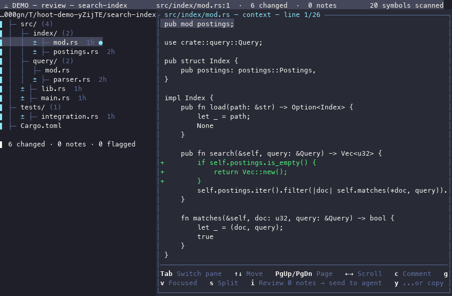

# hoot

A terminal UI I use for reviewing a git working tree alongside a coding agent — [opencode](https://opencode.ai) by default, or [pi](https://github.com/earendil-works/pi) if you prefer it — built with [ratatui](https://ratatui.rs).

One screen, three modes: look at what changed, pick exactly which hunks go into a commit, and — optionally — chat with an agent. Review is where the review/curate loop actually pays off: leave line-anchored notes on the diff, then `y` copies them as a structured prompt to your clipboard — useful even if you don't run opencode or pi at all, e.g. pasting into a browser-based agent instead. It's a personal tool, not a polished product — expect rough edges.



## Try it without a repo

```sh
cargo run -- --demo
```

`--demo` builds a small git repository in a temp directory — a real one, with a baseline commit and a working tree edited on top of it — opens hoot on that, and deletes it again on exit. Every screen runs exactly the code it would against your own work, so picking hunks apart and even committing them genuinely work; the status line reads `⚠ DEMO` throughout so it's obvious which repo you're in. Nothing outside the temp directory is touched, and the repo's git identity is set locally rather than read from your config.

## Requirements

- Rust (2021 edition), and macOS or Linux — it spawns and signals subprocesses through Unix APIs, so it doesn't build on Windows
- `git` on PATH
- [`opencode`](https://opencode.ai) on PATH (the default agent), or [`pi`](https://github.com/earendil-works/pi) if you run `--agent pi` — only for the Agent pane and commit-message drafting; everything else works without either
- `$VISUAL` or `$EDITOR`, for editing prompts and commit messages (falls back to `vi`)
- Optional: `pbcopy` (macOS) or `wl-copy`/`xclip`/`xsel` (Linux), if you want the clipboard shortcut

## Build & run

```sh
cargo build --release
```

```sh
./target/release/hoot            # review the repo in the current directory
./target/release/hoot /path/to/repo
./target/release/hoot --agent pi # drive the Agent pane with pi instead of opencode
```

There's no published release yet, so building from source is the only way in for now. Pushing a `vX.Y.Z` tag builds binaries, a `.deb` and an `.rpm` and attaches them to a GitHub Release — see [`packaging/`](packaging/README.md).

It polls the working tree every second, so changes from elsewhere — another agent run, an editor, plain `git` — show up on their own.

## Modes

Switch with **F1 / F2 / F3**, or **Ctrl+R / Ctrl+U / Ctrl+A** if your laptop maps F1–F3 to brightness and the like. Review and Curate — the two you'll actually live in — get F1/F2; Agent is F3.

- **Review** — file tree + diff. Leave notes (`c`), flag files for rework (`x`), mark a file good (`g`), clear stale notes with `d` (this file) or `D` (everywhere), then either `i` to send it all to the agent or `y` to copy the same prompt to your clipboard if you're running the agent somewhere else. `v` collapses the unchanged stretches of a long diff; `s` switches to before/after columns.
- **Curate** — select hunks per file, draft a commit message with the agent (`g`), give it a last look in `$EDITOR` (`e`), commit (`c`). `r` jumps to the current hunk's file in Review, tree and content both.
- **Agent** — chat with a real agent session (opencode by default, pi with `--agent pi`); it reads and writes the repo directly, with tool-call permissions auto-approved (opencode's `--auto`) — there's no sandbox or approval prompt. pi additionally runs every turn, including read-only ones, with `--approve` ("trust project-local files for this run" — real code execution from whatever's in the repo, independent of the tool permissions). `git diff`/`git log` let you review and revert tracked-file edits, but that's not a full undo: a deleted untracked file, a shell command it ran, or anything it read outside the repo isn't something git can take back. Point it at repos and prompts you'd trust with your own shell. `Esc` kills a turn mid-run (also works while Curate is generating a commit message) — nothing else stops one short of quitting hoot entirely.

From anywhere: **Ctrl+F** is a fuzzy file finder with a live preview, **Ctrl+K** a fuzzy symbol jump. The symbol scan is a heuristic — it matches common definition shapes (`fn`, `func`, `def`, `class`, `struct`, ...) by prefix rather than parsing anything, so treat it as a fast way to get near something, not as a language server.

The first real agent turn on a given machine asks for an explicit confirmation of the above before it runs — a one-time prompt tracked per backend (`~/.hoot-agent-trust-ack-opencode`, `~/.hoot-agent-trust-ack-pi`), not shown again for that backend after you accept it.

### What Curate actually commits

Every selection — one hunk or the whole file — is staged by replaying the patch you just looked at through `git apply --cached`. Nothing is staged by path, so nothing can be picked up off disk after you reviewed it: the bytes in the commit are the bytes that were on screen. Before committing, hoot re-reads the index and checks it holds exactly the selection.

A few consequences worth knowing:

- **Renames and mode changes are shown, and travel with the file.** An executable bit that flipped appears in Curate as `mode 100644 → 100755 (made executable)` and is committed along with the content — never invisibly.
- **A change with no lines is still a change.** A `chmod +x` on its own, or a new empty file, is one selectable unit with nothing to scroll through.
- **Binary files and submodule pointers are refused, not guessed at.** They're shown, labelled, and offer nothing to select. Stage those with plain `git add`.
- **Anything already staged outside hoot blocks the commit** — hoot only mutates an index it knows started clean, rather than deciding on your behalf what to do with work you staged by hand. Note that `git mv` stages the rename itself, so a repo mid-`git mv` falls into this case: finish it with `git commit` directly.
- **A running agent turn blocks the commit too.** It's writing to the same tree, and nothing it has written mid-turn has been reviewed. `Esc` cancels the turn.

Quitting (`q` or `Ctrl+C`) asks for confirmation first if there's anything in-memory that would be lost — queued notes, flagged files, a drafted commit message, or a turn still running.

## Keybindings

Every command key is remappable via `~/.hoot.toml`:

```toml
quit = "ctrl+q"
review_comment = "ctrl+e"
```

Two things deliberately aren't: `Ctrl+C`, which is a fixed way out, and plain text entry (typing and Backspace in the agent prompt, the note field, and the fuzzy filters).

Run `hoot --print-keymap` to regenerate [KEYBINDINGS.md](KEYBINDINGS.md), the full reference — it's generated from `src/keymap.rs`, so it can't drift from what the binary does.

## Layout

| Path | What's there |
|---|---|
| `src/app.rs` | App state and interaction logic |
| `src/ui/` | Rendering — one file per mode/overlay |
| `src/agent_client.rs` | Backend-agnostic agent types shared by both clients |
| `src/opencode_client.rs`, `src/pi_client.rs` | Spawn the chosen agent, stream its event log |
| `src/gitreview.rs`, `src/gitcommit.rs` | Real `git diff` / `git commit` |
| `src/demo.rs` | The throwaway repository `--demo` builds and reviews |
| `src/fsnav.rs`, `src/syntax.rs` | File tree, heuristic symbol scan, single-line highlighting |
| `src/keymap.rs` | Bindings, defaults, `~/.hoot.toml` overrides |
| `src/editor.rs`, `src/clipboard.rs` | Shelling out to `$EDITOR` and the system clipboard |
| `packaging/` | Release packaging notes (`.deb`/`.rpm`, Homebrew, COPR, AUR) |

## License

MIT — see [LICENSE](LICENSE).
